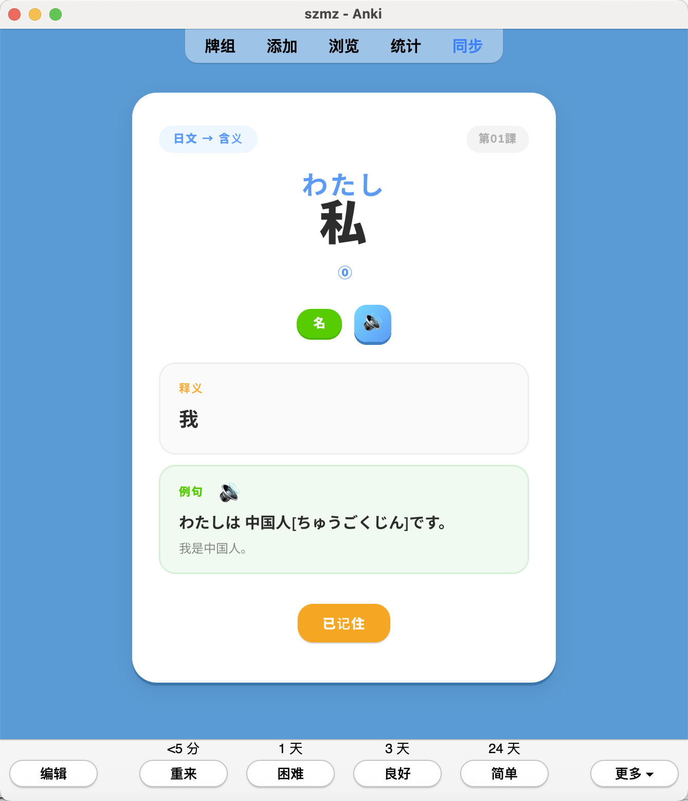
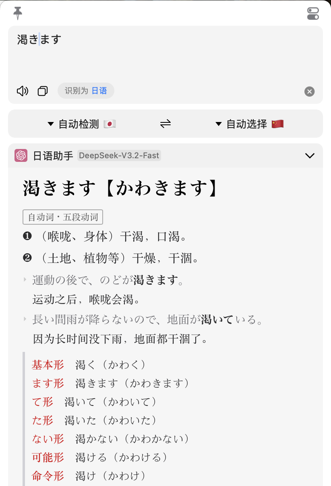
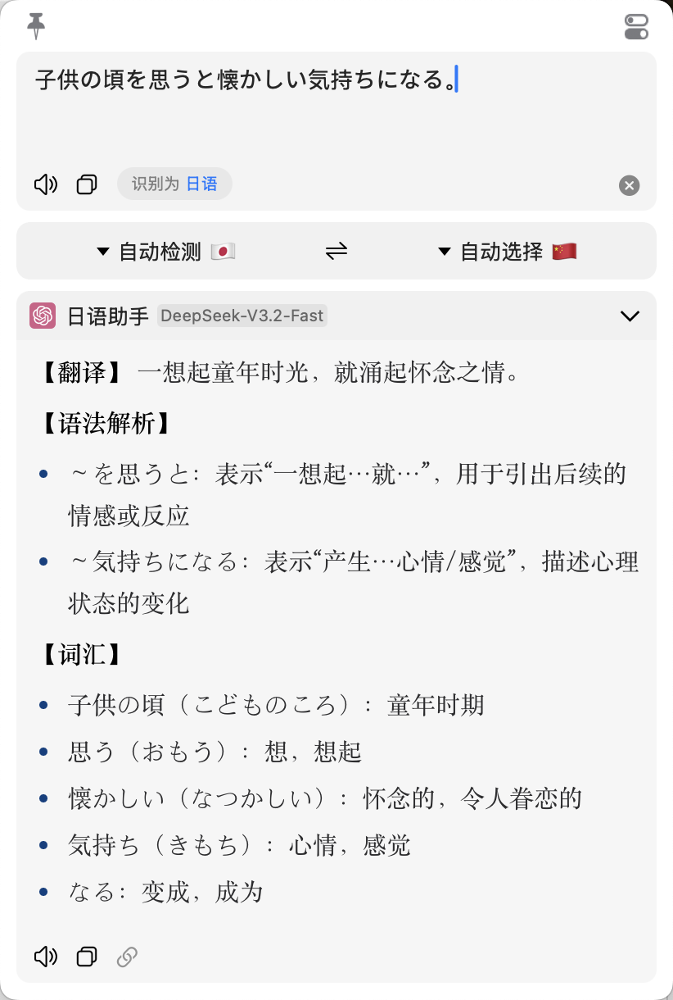

# 日语学习 Tools

《大家的日语》初级 1-2（第 1-50 课）配套学习系统。通过 [Claude Code](https://claude.com/claude-code) 驱动笔记整理、Anki 卡片管理和语音生成的自动化。两人共用，复习进度独立。

## 包含什么

**学习笔记** — 核心是 `日语笔记.md`，按 7 个模块组织全部语法知识：从假名和声调基础（モジュール0），到名词句、形容词句等基础句型（モジュール1），动词活用（ます形、て形、ない形、た形、辞書形、普通体，モジュール2），形容词和名词的否定、过去、比较（モジュール3），再到授受、许可禁止、条件等句型扩展（モジュール4-6）。每个语法点配有日中双语例句。

上完新课后有两种方式更新笔记，都通过 Claude Code 自动完成：
- 把老师发的**课件 PDF** 放到 `初级1/` 或 `初级2/`，agent 自动读取并提取语法点，按模块归入笔记
- 在 **`template.md`** 里随手记几笔新语法和生词，agent 自动识别内容类型——语法写入笔记，单词添加到 Anki

此外还有 `课后语法速查.md`，按课号索引全部语法点，做课后练习时快查，也会随笔记自动更新。

**教材资料** — `初级1/` 和 `初级2/` 存放教材 PDF、课件和文法总结。`文法.md` 是从教材 OCR 扫描件中提取的全部语法点汇总（同样通过 agent 自动提取和修正日文乱码），也是 Anki 文法卡的数据源。

**Anki 记忆卡** — 通过 AnkiConnect 自动导入和管理，Duolingo 风格卡片。单词卡 2387 词（1-50 课），含注音、音调、词性、例句和语音；文法卡 139 个语法点（1-25 课），包括语法认识卡和多邻国风选择题。两个 Profile（szmz / czh）共享词库、复习进度独立。补充新词、生成语音、调整复习策略等操作都可以通过 agent 完成，详见 [anki/README.md](anki/README.md)。

卡片音频分两部分：单词发音使用教材原生录音（2263 个 MP3），补充单词通过 [VOICEVOX](https://voicevox.hiroshiba.jp/) 琴詠ニア音色合成；例句发音统一使用 VOICEVOX WhiteCUL「楽しい」音色（温柔女声，适合听力练习）。



**Easydict 日中辞书** — macOS 上的智能查词翻译工具，开箱即用。输入单词返回词典级解析（词头、词性、多义项释义、例句、动词活用形），输入句子获得翻译 + 语法解析 + 关键词提取三合一结果。支持划词翻译和 OCR 截图翻译（漫画、网页、游戏等）。京都风明朝体排版，仿传统辞书质感。基于开源项目 [Easydict](https://github.com/tisfeng/Easydict) 定制。

<p>


</p>

## 目录结构

```
日语资料/
├── 日语笔记.md             # 主笔记（按模块组织全部语法）
├── 课后语法速查.md          # 按课号的语法速查
├── template.md            # 新课内容暂存区
├── 初级1/                  # 教材 PDF + 课件 + 文法.md
├── 初级2/                  # 教材 PDF + 文法.md
├── anki/                  # Anki 工具集（详见 anki/README.md）
```

## 配置

### 环境准备

1. 安装 [Anki](https://apps.ankiweb.net/) 桌面版
2. 在 Anki 中安装 [AnkiConnect](https://ankiweb.net/shared/info/2055492159) 插件（工具 → 插件 → 获取插件，输入代码 `2055492159`）
3. 在 Anki 中创建两个 Profile：`szmz` 和 `czh`（文件 → 切换用户 → 添加）
4. 安装 [Claude Code](https://claude.com/claude-code)
5. 可选：安装 [VOICEVOX](https://voicevox.hiroshiba.jp/)（生成例句日语语音时需要）

### 首次导入

确保 Anki 桌面版已打开，然后在项目目录下运行：

```bash
python3 anki/sync.py                 # 导入单词卡（两个 Profile）
python3 anki/create_grammar_deck.py  # 导入文法卡（两个 Profile）
python3 anki/config.py               # 配置复习策略
```

导入后在 Anki 桌面版点「同步」，手机端（AnkiMobile / AnkiDroid）登录对应的 AnkiWeb 账号即可开始复习。

### 日常使用

在项目目录下打开 Claude Code，用自然语言描述需求即可。agent 会根据内容自动调用对应的脚本：

- 放了新课件 → "新课件 第21课" → 自动提取语法、更新笔记
- 写了 template → "整理 template" → 语法归笔记、单词进 Anki
- 想加新词 → "加词：食べる たべる 動II 吃" → 两个 Profile 都加
- 要生成语音 → "生成例句音频" → VOICEVOX 合成并写入卡片

## 扩展新教材

整套工具不绑定初级 1-2，后续学中级、高级时可以直接复用。新建一个目录（如 `中级1/`），放入教材和文法总结，Anki 脚本里加上新的牌组名即可——文法解析、卡片生成、例句 TTS、双 Profile 同步等流程都是通用的。
